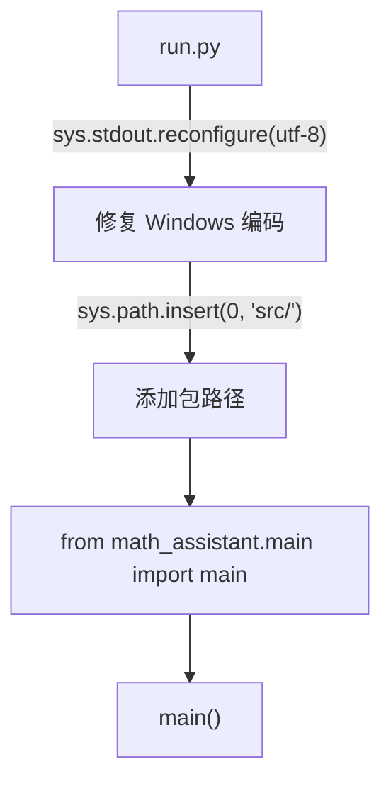
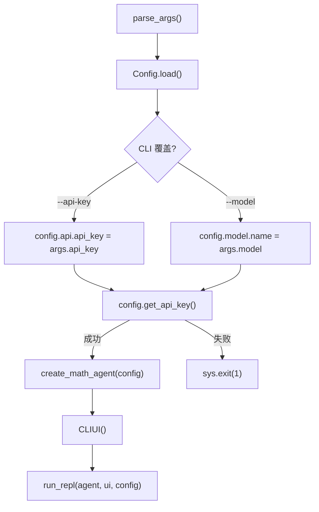
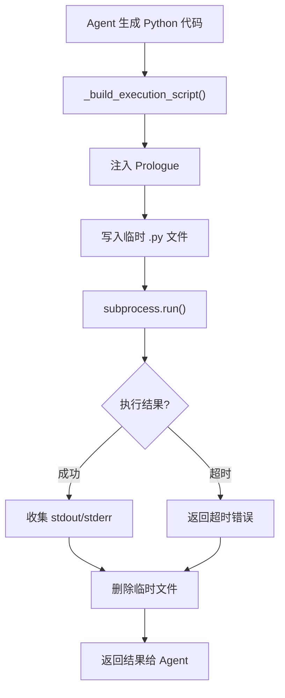
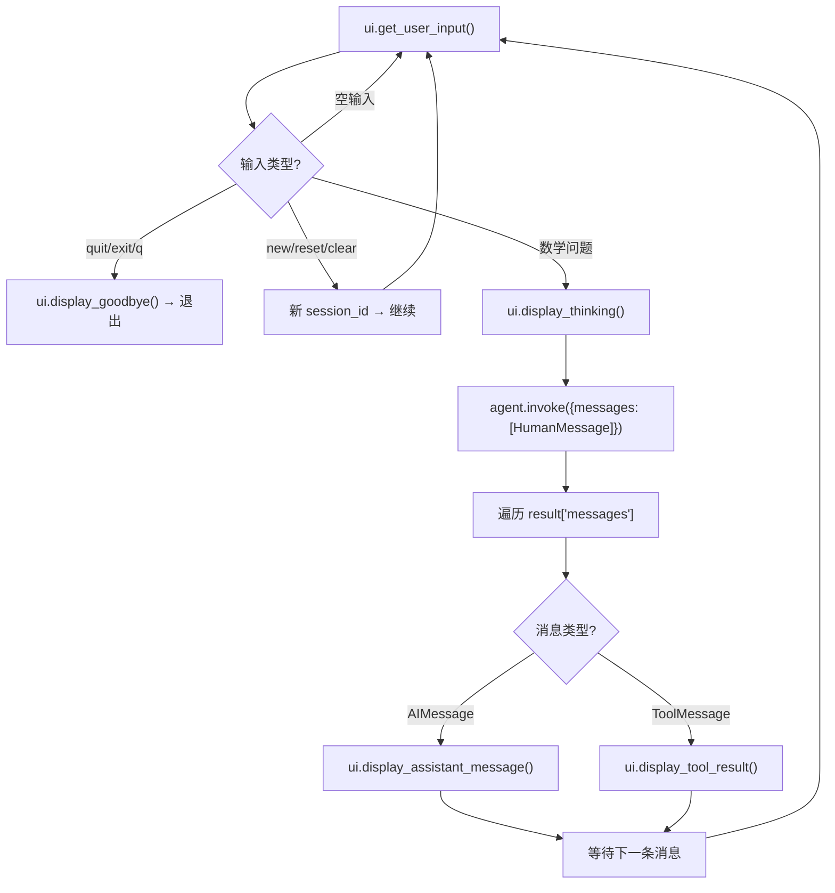
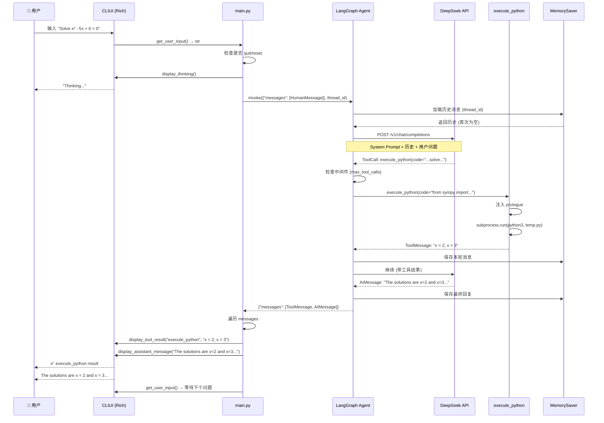

# MathAssistant Agent 工作流详解

## 目录

- [1. 项目概览](#1-项目概览)
- [2. 启动流程](#2-启动流程)
- [3. 配置系统](#3-配置系统)
- [4. Agent 构建](#4-agent-构建)
- [5. 工具系统](#5-工具系统)
- [6. 搜索提供商插件](#6-搜索提供商插件)
- [7. REPL 交互循环](#7-repl-交互循环)
- [8. UI 层设计](#8-ui-层设计)
- [9. 系统提示词与角色设定](#9-系统提示词与角色设定)
- [10. 完整请求处理时序](#10-完整请求处理时序)
- [11. 配置参考](#11-配置参考)

---

## 1. 项目概览

MathAssistant 是一个 **AI 驱动的数学教师 Agent**，基于 LangChain/LangGraph 框架构建。用户通过终端与 Agent 进行多轮对话，Agent 可以调用 Python 执行引擎和网络搜索工具来解答数学问题。

```
┌──────────┐     ┌──────────────┐     ┌─────────────────┐
│  用户输入  │ ──▶ │  REPL 循环    │ ──▶ │  LangGraph Agent │
│  (终端)   │ ◀── │  (main.py)   │ ◀── │  (agent.py)      │
└──────────┘     └──────────────┘     └───────┬─────────┘
                                               │
                                    ┌──────────┴──────────┐
                                    │                     │
                              ┌─────┴─────┐        ┌─────┴─────┐
                              │ execute_  │        │ web_search │
                              │ python    │        │            │
                              └─────┬─────┘        └─────┬─────┘
                                    │                     │
                               subprocess           DuckDuckGo
                              (sympy/numpy/         (或 Tavily/
                               matplotlib)          SerpAPI/...)
```

### 技术栈

| 组件 | 技术 |
|------|------|
| Agent 框架 | LangChain + LangGraph |
| LLM 客户端 | `langchain-openai` (OpenAI 兼容协议) |
| 默认模型 | DeepSeek Chat |
| 数学计算 | SymPy (符号计算), NumPy (数值计算) |
| 图表生成 | Matplotlib (Agg 后端, 无需 GUI) |
| 网络搜索 | DuckDuckGo (免费, 无需 API Key) |
| 终端 UI | Rich (Markdown 渲染, Panel, 颜色) |
| 配置管理 | Pydantic + YAML + 环境变量 |
| 会话记忆 | LangGraph `MemorySaver` (内存检查点) |

### 项目结构

```
MathAssistant/
├── run.py                          # 启动入口
├── config.yaml                     # 主配置 (可提交)
├── config.local.yaml               # 本地密钥 (gitignore)
├── src/math_assistant/
│   ├── main.py                     # CLI 入口 + REPL 循环
│   ├── agent.py                    # Agent 组装 (LLM + 工具 + 中间件)
│   ├── config.py                   # 配置模型 + 分层加载
│   ├── prompts.py                  # System Prompt + Welcome 消息
│   ├── tools/
│   │   ├── python_executor.py      # Python 代码执行工具
│   │   └── search.py               # 网络搜索工具
│   ├── search_providers/
│   │   ├── base.py                 # 抽象基类 + 类型定义
│   │   ├── duckduckgo.py           # DuckDuckGo 实现
│   │   └── __init__.py             # 注册表 + 工厂函数
│   └── ui/
│       ├── base.py                 # 抽象 UI 接口
│       └── cli.py                  # Rich 终端实现
└── images/                         # 图表输出目录
```

---

## 2. 启动流程

### 2.1 入口: `run.py`

```
python run.py [--config PATH] [--api-key KEY] [--model NAME]
```



**关键细节**:

- **Windows UTF-8 修复** ([run.py:16-18](run.py)): 在 `win32` 平台强制 `sys.stdout.reconfigure(encoding="utf-8")`，解决 Rich 渲染 emoji 时的 GBK 编码错误
- **包路径注入**: 将 `src/` 加入 `sys.path`，使 `from math_assistant.main import main` 能正确解析

### 2.2 主函数: `main()`



**三个步骤**:

1. **参数解析** ([main.py:20-49](src/math_assistant/main.py)) — `argparse` 解析 `--config`、`--api-key`、`--model`
2. **配置加载** — 三层优先级合并 (详见 [第3节](#3-配置系统))
3. **Agent 创建** — 组装 LLM + 工具 + 中间件 + 检查点 (详见 [第4节](#4-agent-构建))

---

## 3. 配置系统

### 3.1 三层加载机制 (后加载覆盖先加载)

```
优先级: 低 ──────────────────────────────▶ 高

  Layer 1                Layer 2               Layer 3
┌─────────────┐     ┌──────────────────┐     ┌────────────────┐
│ config.yaml │  <  │ config.local.yaml │  < │ 环境变量         │
│ (提交到 Git) │     │ (gitignored)      │     │ MATH_ASSISTANT_* │
└─────────────┘     └──────────────────┘     └────────────────┘
```

### 3.2 加载过程

```python
# config.py Config.load() 伪代码
def load(config_path=None):
    # 1. 确定配置文件位置
    config_path = config_path or "<project_root>/config.yaml"
    config_dir = Path(config_path).parent      # 项目根目录
    config_name = Path(config_path).stem        # "config"

    # 2. Layer 1: 加载主配置
    yaml_data = yaml.safe_load(open("config.yaml", encoding="utf-8"))

    # 3. Layer 2: 加载本地覆盖 (如果存在)
    local_path = config_dir / f"{config_name}.local.yaml"
    if local_path.exists():
        local_data = yaml.safe_load(open(local_path, encoding="utf-8"))
        yaml_data = deep_merge(yaml_data, local_data)  # 递归合并

    # 4. Layer 3: 环境变量覆盖 (最高优先级)
    for env_var, config_path in ENV_MAP.items():
        if value := os.environ.get(env_var):
            set_nested(config_dict, config_path, value)
```

### 3.3 环境变量映射

| 环境变量 | 覆盖字段 | 类型转换 |
|----------|---------|---------|
| `DEEPSEEK_API_KEY` | `api.api_key` | string |
| `MATH_ASSISTANT_API_KEY` | `api.api_key` | string |
| `OPENAI_API_KEY` | `api.api_key` | string |
| `MATH_ASSISTANT_BASE_URL` | `api.base_url` | string |
| `MATH_ASSISTANT_MODEL` | `model.name` | string |
| `MATH_ASSISTANT_TEMPERATURE` | `model.temperature` | float |
| `MATH_ASSISTANT_SEARCH_PROVIDER` | `search.provider` | string |
| `MATH_ASSISTANT_PYTHON_TIMEOUT` | `python_executor.timeout_seconds` | int |
| `MATH_ASSISTANT_MAX_TOOL_CALLS` | `agent.max_tool_calls` | int |
| `MATH_ASSISTANT_IMAGE_DIR` | `output.image_dir` | string |

### 3.4 配置模型结构

```python
class Config(BaseModel):
    model: ModelConfig          # provider, name, temperature
    api: ApiConfig              # base_url, api_key
    search: SearchConfig        # provider
    python_executor: PythonExecutorConfig  # timeout_seconds, allowed_imports
    agent: AgentConfig          # max_tool_calls
    output: OutputConfig        # image_dir
```

### 3.5 API Key 解析

`get_api_key()` 按优先级检查:
1. `config.api.api_key` (来自 `config.local.yaml` 或 `--api-key` 参数或环境变量)
2. 若为空，抛出包含修复指引的 `ValueError`

---

## 4. Agent 构建

### 4.1 核心组装

```python
# agent.py — create_math_agent(config)
def create_math_agent(config):
    # 1. 创建 LLM 客户端
    llm = ChatOpenAI(
        model=config.model.name,           # "deepseek-chat"
        api_key=config.get_api_key(),      # 从配置获取
        base_url=config.api.base_url,      # "https://api.deepseek.com"
        temperature=config.model.temperature,  # 0.0 (确定性输出)
    )

    # 2. 设置搜索工具提供商
    search_provider = get_search_provider(config.search.provider)  # "duckduckgo"
    search_tool = create_search_tool(search_provider)

    # 3. 组装工具列表
    tools = [search_tool, execute_python]

    # 4. 构建中间件
    middleware = [
        ToolCallLimitMiddleware(run_limit=config.agent.max_tool_calls),
    ]

    # 5. 创建检查点 (多轮会话记忆)
    checkpointer = MemorySaver()

    # 6. 编译 LangGraph Agent
    agent = create_agent(
        model=llm,
        tools=tools,
        system_prompt=SYSTEM_PROMPT,
        middleware=middleware,
        checkpointer=checkpointer,
    )
    return agent
```

### 4.2 各组件职责

| 组件 | 类 | 职责 |
|------|-----|------|
| **LLM** | `ChatOpenAI` | 通过 OpenAI 兼容 API 调用 DeepSeek (或其他模型) |
| **Tools** | `@tool` 函数列表 | Agent 可调用的外部能力 (Python 执行、搜索) |
| **Middleware** | `ToolCallLimitMiddleware` | 限制每轮最大工具调用次数 (默认 20) |
| **Checkpointer** | `MemorySaver` | 保存对话历史，实现多轮记忆 |
| **System Prompt** | `SYSTEM_PROMPT` 字符串 | 定义 MathTutor 角色、教学哲学、工具使用规则 |

### 4.3 LangGraph 状态图

`create_agent()` 内部将上述组件编译为 LangGraph 状态图:

```
     ┌──────────┐
     │  START   │
     └────┬─────┘
          ▼
   ┌─────────────┐
   │   LLM 调用   │◄──────────────┐
   │ (带 System   │               │
   │  Prompt +    │               │
   │  历史消息)    │               │
   └──────┬──────┘               │
          │                      │
     ┌────┴────┐                 │
     │ 判断输出  │                 │
     └────┬────┘                 │
          │                      │
    ┌─────┴─────┐                │
    │           │                │
    ▼           ▼                │
┌───────┐  ┌──────────┐         │
│AIMessage│ │ToolCall   │        │
│ (文本)  │ │ (工具调用)  │        │
└───┬───┘  └────┬─────┘         │
    │           │                │
    ▼           ▼                │
  [返回]   ┌──────────┐          │
           │ 执行工具   │          │
           └────┬─────┘          │
                ▼                │
           ┌──────────┐          │
           │ToolMessage│─────────┘
           │ (工具结果)  │  重新调用 LLM
           └──────────┘
```

---

## 5. 工具系统

### 5.1 `execute_python` — Python 代码执行器

**文件**: [src/math_assistant/tools/python_executor.py](src/math_assistant/tools/python_executor.py)

#### 工作流



#### Prologue 注入

在用户代码之前自动注入以下内容:

```python
import os
os.environ['MPLBACKEND'] = 'Agg'     # 无头模式
import matplotlib
matplotlib.use('Agg')                 # 无需 GUI
import sympy as sp
import numpy as np
import matplotlib.pyplot as plt
import math, json
from sympy import (symbols, Eq, solve, diff, integrate, limit,
                   simplify, expand, factor, Matrix,
                   sin, cos, tan, log, exp, sqrt, pi, oo)
```

#### 安全措施

- **超时保护**: 默认 30 秒，通过 `subprocess.run(timeout=...)` 实现
- **临时文件隔离**: 代码写入 `tempfile.NamedTemporaryFile`，执行后自动删除
- **Agg 后端**: Matplotlib 使用 Agg 后端，不会弹出 GUI 窗口
- **子进程隔离**: 代码在独立子进程中运行，崩溃不影响主进程

#### 工具签名

```python
@tool(args_schema=PythonCodeInput)
def execute_python(
    code: str,                      # Python 代码
    image_dir: str = "./images",    # 图表输出目录
    timeout_seconds: int = 30       # 超时时间
) -> str:
```

### 5.2 `web_search` — 网络搜索工具

**文件**: [src/math_assistant/tools/search.py](src/math_assistant/tools/search.py)

#### 架构

采用**策略模式**: 工具函数本身是固定的，但搜索实现通过模块级全局变量 `_current_provider` 注入:

```python
# 模块级全局变量
_current_provider: BaseSearchProvider | None = None

@tool(args_schema=SearchInput)
def web_search(query: str, num_results: int = 5) -> str:
    results = _current_provider.search(query, max_results=num_results)
    return format_results(results)

def create_search_tool(provider: BaseSearchProvider):
    """注入搜索提供商，返回配置好的工具函数"""
    global _current_provider
    _current_provider = provider
    return web_search
```

#### 工具签名

```python
@tool(args_schema=SearchInput)
def web_search(
    query: str,          # 搜索关键词
    num_results: int = 5 # 返回结果数 (1-10)
) -> str:
```

#### 返回格式

```
Search results for: **<query>**

1. **<title>**
   URL: <url>
   <snippet>

2. ...
```

---

## 6. 搜索提供商插件

### 6.1 抽象基类

```python
class SearchResult(TypedDict):
    title: str
    url: str
    snippet: str

class BaseSearchProvider(ABC):
    @abstractmethod
    def search(self, query: str, max_results: int = 5) -> list[SearchResult]: ...

    @abstractmethod
    def name(self) -> str: ...
```

### 6.2 当前实现: DuckDuckGo

**文件**: [src/math_assistant/search_providers/duckduckgo.py](src/math_assistant/search_providers/duckduckgo.py)

- 使用 `duckduckgo_search` 库
- **免费，无需 API Key**
- 支持 `region` 和 `safesearch` 参数
- 异常时返回错误结果而非抛出异常

### 6.3 注册表

```python
PROVIDER_REGISTRY: dict[str, type[BaseSearchProvider]] = {
    "duckduckgo": DuckDuckGoSearchProvider,
    # 扩展点: 取消注释并实现即可添加
    # "tavily":    TavilySearchProvider,
    # "serpapi":   SerpAPISearchProvider,
    # "google":    GoogleSearchProvider,
}

def get_search_provider(name: str, **kwargs) -> BaseSearchProvider:
    """工厂函数: 按名称创建搜索提供商实例"""
```

### 6.4 如何添加新的搜索提供商

```
1. 创建 src/math_assistant/search_providers/tavily.py
2. 实现 class TavilySearchProvider(BaseSearchProvider)
3. 在 __init__.py 的 PROVIDER_REGISTRY 中注册
4. 在 config.yaml 中设置 search.provider: "tavily"
```

---

## 7. REPL 交互循环

### 7.1 会话管理

每次启动生成唯一的 `session_id` (UUID 前 8 位)，作为 LangGraph 的 `thread_id`:

```python
session_id = str(uuid.uuid4())[:8]
graph_config = {"configurable": {"thread_id": session_id}}
```

- **`new` / `reset` / `clear`**: 生成新 `session_id`，清空对话历史
- **`quit` / `exit` / `q`**: 退出程序

### 7.2 消息处理循环



### 7.3 Agent 调用细节

```python
result = agent.invoke(
    {"messages": [HumanMessage(content=user_input)]},
    config={"configurable": {"thread_id": session_id}},
)
```

- `invoke()` 是**同步阻塞**调用
- `config` 中的 `thread_id` 让 LangGraph 的 `MemorySaver` 自动加载该会话的历史消息
- 返回值 `result["messages"]` 包含本轮新增的所有消息 (AIMessage + ToolMessage)
- 历史消息由 checkpointer 自动管理，无需手动拼接

---

## 8. UI 层设计

### 8.1 抽象接口

```python
class AbstractUI(ABC):
    @abstractmethod
    def display_welcome(self) -> None: ...
    @abstractmethod
    def display_assistant_message(self, content: str) -> None: ...
    @abstractmethod
    def display_tool_call(self, tool_name: str, tool_input: dict) -> None: ...
    @abstractmethod
    def display_tool_result(self, tool_name: str, result: str) -> None: ...
    @abstractmethod
    def display_error(self, message: str) -> None: ...
    @abstractmethod
    def display_thinking(self) -> None: ...
    @abstractmethod
    def get_user_input(self) -> str: ...
    @abstractmethod
    def display_goodbye(self) -> None: ...
```

### 8.2 CLI 实现 (Rich)

| 方法 | Rich 实现方式 |
|------|-------------|
| `display_welcome` | `console.print(WELCOME_MESSAGE)` - 带 emoji 的欢迎面板 |
| `display_assistant_message` | `console.print(Markdown(content))` - Markdown 渲染 |
| `display_tool_call` | `Panel(..., title=f"[bold cyan]⚙ {name}")` - 带颜色的面板 |
| `display_tool_result` | `Panel(preview, title=f"[bold]✅ {name} result")` - 截断 500 字符 |
| `display_thinking` | `console.print("[dim]Thinking...[/dim]", end="\r")` - 行内覆盖 |
| `get_user_input` | `console.input("[bold green]You:[/bold green]")` - 绿色提示符 |

### 8.3 可扩展性

由于 Agent 逻辑只操作 `AbstractUI` 接口，可以轻松实现:
- **Gradio UI** — 网页界面
- **Streamlit UI** — 数据科学风格界面
- **WebSocket UI** — 远程终端

---

## 9. 系统提示词与角色设定

### 9.1 MathTutor 角色

系统提示词将 LLM 塑造为一位**热情、渊博的数学教师**:

> You are **MathTutor** — a warm, enthusiastic, and deeply knowledgeable mathematics teacher.

### 9.2 五大教学原则

| 原则 | 说明 |
|------|------|
| **解释 "为什么"** | 不仅陈述公式，还要阐释推理过程；使用类比和现实联系 |
| **逐步推理** | 将每个问题分解为逻辑阶段，说明每一步做什么及为什么 |
| **多重表征** | 同时用语言、符号、图形描述概念 |
| **鼓励与引导** | 庆祝洞见，困惑时温和引导，始终以邀请结束 |
| **生动语言** | 自由使用类比 (如 "积分就像一滴一滴往浴缸里加水") |

### 9.3 工具使用规则

| 工具 | 何时使用 | 何时不用 |
|------|---------|---------|
| `execute_python` | 解方程、微积分、矩阵运算、绘图、统计 | 简单心算、纯概念解释 |
| `web_search` | 查找定理、定义、证明、历史背景 | 已确定的知识 |

### 9.4 关键行为约束

- 代码出错时自己调试修复
- 验证计算结果是否符合直觉
- 问题模糊时请求澄清，不猜测
- 图表保存到 `images/` 目录
- **始终以邀请结束回复** ("Would you like me to elaborate on any part?")

---

## 10. 完整请求处理时序

以下是一个典型请求 `"Solve x² - 5x + 6 = 0"` 的完整时序:



---

## 11. 配置参考

### 11.1 `config.yaml` — 完整示例

```yaml
model:
  provider: deepseek          # LLM 提供商
  name: deepseek-chat         # 模型名称
  temperature: 0.0            # 温度 (0.0=确定, 2.0=随机)

api:
  base_url: "https://api.deepseek.com"  # API 端点
  # api_key 在 config.local.yaml 或环境变量中设置

search:
  provider: duckduckgo        # duckduckgo | tavily | serpapi

python_executor:
  timeout_seconds: 30         # Python 执行超时 (1-120)

agent:
  max_tool_calls: 20          # 每轮最大工具调用次数 (1-100)

output:
  image_dir: "./images"       # 图表输出目录
```

### 11.2 `config.local.yaml` — 密钥文件 (gitignored)

```yaml
api:
  api_key: "sk-xxxxxxxxxxxxxxxxxxxxxxxxxxxxxxxx"
```

### 11.3 命令行参数

```
python run.py --config /path/to/config.yaml   # 自定义配置文件路径
python run.py --api-key sk-xxx                # 命令行传入 API Key
python run.py --model deepseek-chat           # 覆盖模型
```

---

## 附录: 关键设计决策

| 决策 | 原因 |
|------|------|
| 使用 LangGraph `create_agent()` | 开箱即用的 Agent 循环 + 工具调用 + 中间件支持 |
| `MemorySaver` 而非持久化存储 | 简化部署，重启即清空历史；适合教学场景 |
| 配置分层 (YAML → local → ENV) | 兼顾团队共享、本地密钥安全、CI/CD 灵活性 |
| 搜索策略模式 | 方便切换搜索后端，不影响工具签名 |
| `AbstractUI` 接口解耦 | 后续可加 Gradio/Streamlit 前端，不修改 Agent 代码 |
| Windows UTF-8 强制重配置 | 解决 Rich emoji 渲染的 GBK 编码问题 |
| Python 子进程执行 | 安全隔离，超时可控，崩溃不影响主进程 |
| Agg 后端 + 无头 Matplotlib | 服务器/Docker 环境也可生成图表 |
| temperature=0.0 | 数学解答需要确定性，避免同一问题给出矛盾答案 |
